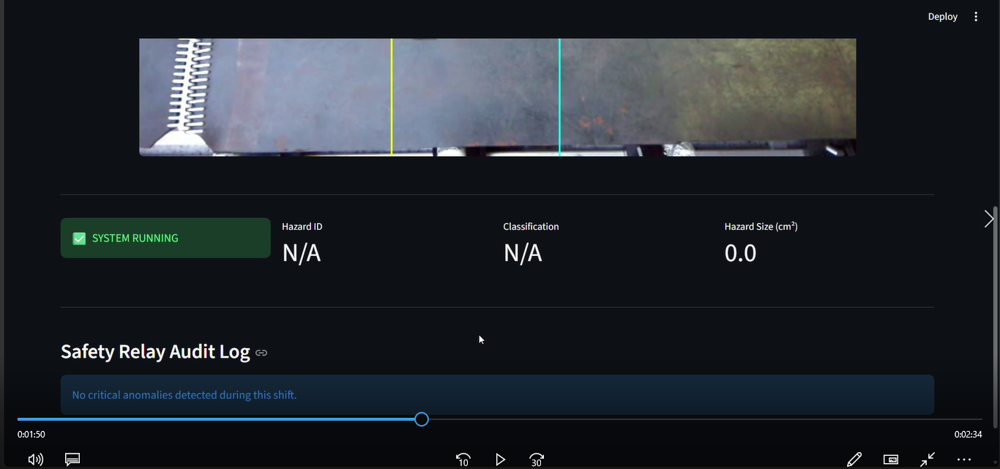
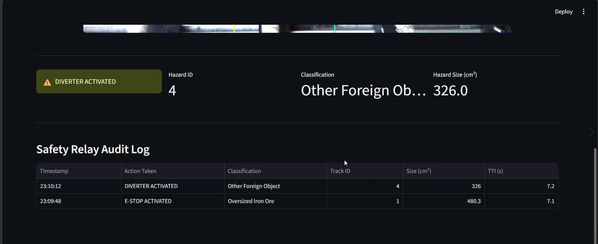
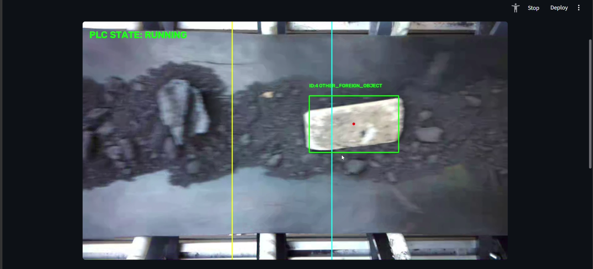
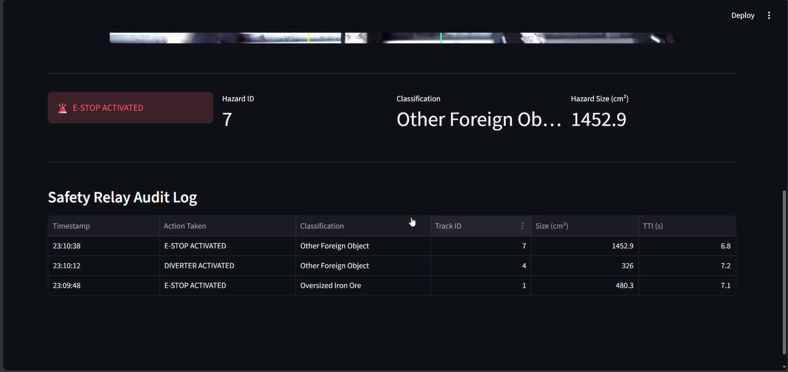
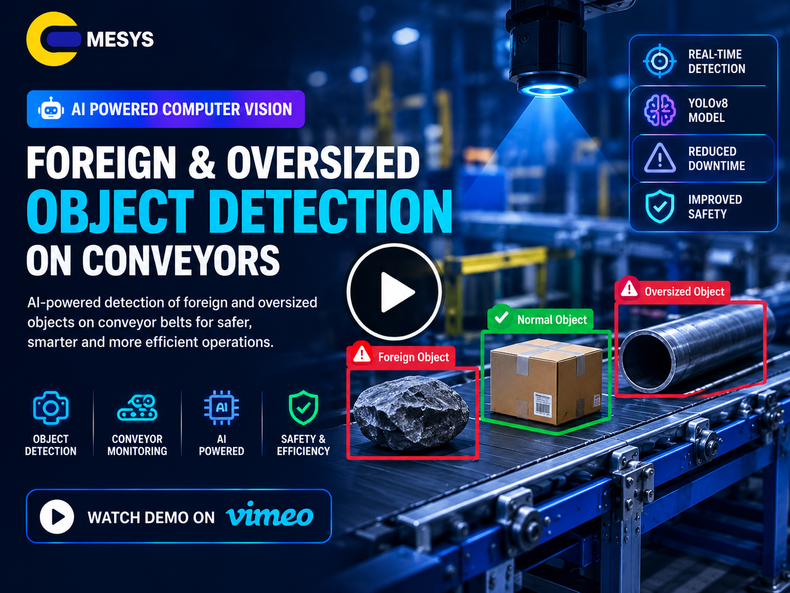

# 🏭 AI-Powered Conveyor Vision System

> **Intelligent Foreign & Oversized Object Detection for Industrial Conveyors**
>
> An AI-powered computer vision system designed to continuously monitor iron ore conveyor belts, detect foreign and oversized objects, track hazards spatially, calculate real-time kinematics, and provide automated safety actuation through a SCADA-ready control architecture.

---

<p align="center">


</p>

---

# 📑 Table of Contents

- [Project Overview](#-project-overview)
- [Industry Problem](#-industry-problem)
- [Our Solution](#-our-solution)
- [Key Features](#-key-features)
- [System Workflow](#-system-workflow)
- [Dataset](#-dataset)
- [AI Model](#-ai-model)
- [Vision Engine](#-vision-engine)
- [Kinematic Engine](#-kinematic-engine)
- [Signal Stability](#-signal-stability)
- [Actuation Logic](#-actuation-logic)
- [SCADA Interface](#-scada-interface)
- [Data Bridge](#-data-bridge)
- [Technology Stack](#-technology-stack)
- [Project Architecture](#-project-architecture)
- [Deployment Architecture](#-deployment-architecture)
- [Project Screenshots](#-project-screenshots)
- [Project Demo](#-project-demo)
- [License](#-license)

---

# 🏭 Project Overview

The **AI-Powered Conveyor Vision System** is an industrial computer vision solution designed for **iron ore processing and conveyor-based material handling environments**.

The system continuously analyzes conveyor belt imagery to identify potentially hazardous foreign objects and oversized material before they reach downstream equipment.

The platform combines:

- Computer vision
- Deep learning
- Object tracking
- Spatial analysis
- Kinematic calculations
- Temporal filtering
- Automated safety logic
- SCADA visualization
- Industrial edge deployment

The system is designed around a high-speed vision pipeline that can detect hazards, estimate their physical characteristics, calculate their movement toward downstream equipment, and communicate safety decisions to an actuation layer.

---

# ⚠️ Industry Problem

Manual inspection of conveyor belts in iron ore processing plants can be affected by human fatigue and continuous operating conditions.

Undetected material such as:

- Tramp metal
- Structural timber
- Oversized rock
- Foreign objects

can potentially reach downstream crushers and other processing equipment.

This creates operational and safety challenges, particularly when hazardous objects must be identified and acted upon while the conveyor is continuously moving.

### Key Challenges

- Continuous conveyor monitoring
- High-speed material movement
- Human inspection fatigue
- Oversized material detection
- Foreign object detection
- Duplicate alerts from frame-by-frame detection
- Variable object sizes
- Need for real-time hazard tracking
- Low-latency safety actuation

---

# 🤖 Our Solution

The system introduces an automated **AI-powered conveyor monitoring pipeline** that combines computer vision with spatial tracking and industrial control logic.

### Core Solution

```text
Conveyor Camera Feed
        │
        ▼
AI Vision Engine
        │
        ▼
Object Detection
        │
        ▼
ByteTrack Tracking
        │
        ▼
Spatial & Kinematic Analysis
        │
        ▼
Temporal Stabilization
        │
        ▼
Safety Decision Matrix
        │
        ▼
Virtual PLC
        │
        ├── E-STOP
        ├── DIVERTER
        └── PASS-THROUGH
        │
        ▼
SCADA Dashboard
```

The architecture separates high-speed vision processing from the SCADA interface while maintaining a local communication bridge between the processing and control components.

---

# 🚀 Key Features

## 👁️ AI-Based Object Detection

The vision engine identifies foreign and oversized objects moving across the conveyor.

The target classes include:

- `oversized_iron_ore`
- `canga`
- `jaspilite`
- `wood`
- `other_foreign_object`


---

## 🎯 Spatial Object Tracking

The system uses **ByteTrack** to maintain object identity across consecutive video frames.

Instead of treating every frame detection as a new event, the system maintains a persistent track ID for each detected object.

### Example

```text
Frame 01 → wood #4
Frame 02 → wood #4
Frame 03 → wood #4
Frame 04 → wood #4
```

This enables the system to treat the object as a single tracked event rather than generating duplicate alarms.

---

## 📐 Physical Size Estimation

The system converts image-space object dimensions into an estimated physical surface area using a calibrated conveyor reference.

Objects exceeding the configured physical threshold can be treated as critical hazards.

---

## ⚡ Real-Time Kinematics

The system calculates object velocity using two virtual trip lines.

```text
Line A
  │
  │
  │   Object →
  │
  │
Line B
```

The calibrated distance between the lines is used to calculate movement velocity.

The system then calculates **Time-to-Intercept (TTI)** based on the downstream crusher distance.

---

## 🧠 Temporal Prediction Stabilization

Industrial conveyor environments can contain:

- Motion blur
- Dust
- Temporary visual obstruction
- Single-frame classification errors

A **7-frame temporal buffer** is used for active object tracks.

The system applies statistical mode filtering to stabilize classifications before sending them to the PLC layer.

---

## 🚨 Automated Safety Actuation

The Virtual PLC evaluates:

- Object class
- Physical footprint
- Hazard severity
- Tracking state

and generates an appropriate control state.

Supported actions include:

- **E-STOP**
- **DIVERTER**
- **PASS-THROUGH**

---

## 📊 SCADA Monitoring

A Streamlit-based control dashboard provides:

- Live conveyor video
- PLC state
- System heartbeat
- Safety events
- Audit information
- Fault monitoring

---

# 🔄 System Workflow

```text
                  ┌──────────────────────┐
                  │ Conveyor Camera Feed │
                  └──────────┬───────────┘
                             │
                             ▼
                  ┌──────────────────────┐
                  │ Custom CNN / YOLO11  │
                  │ Object Detection     │
                  └──────────┬───────────┘
                             │
                             ▼
                  ┌──────────────────────┐
                  │ ByteTrack            │
                  │ Object Tracking      │
                  └──────────┬───────────┘
                             │
                             ▼
                  ┌──────────────────────┐
                  │ Spatial Analysis     │
                  │ Object Size          │
                  └──────────┬───────────┘
                             │
                             ▼
                  ┌──────────────────────┐
                  │ Kinematic Engine     │
                  │ Velocity + TTI       │
                  └──────────┬───────────┘
                             │
                             ▼
                  ┌──────────────────────┐
                  │ Temporal Filtering   │
                  │ 7-Frame Buffer       │
                  └──────────┬───────────┘
                             │
                             ▼
                  ┌──────────────────────┐
                  │ Safety Matrix        │
                  └──────────┬───────────┘
                             │
              ┌──────────────┼──────────────┐
              ▼              ▼              ▼
          E-STOP         DIVERTER      PASS-THROUGH
              │              │              │
              └──────────────┼──────────────┘
                             ▼
                  ┌──────────────────────┐
                  │ SCADA Dashboard      │
                  └──────────────────────┘
```

---

# 📊 Dataset

The project uses a combination of industrial conveyor imagery sourced from the **Mendeley Data Iron Ore Conveyor Belts Dataset** and custom-annotated frames captured from operational belt feeds.

### Dataset Structure

| Dataset | Images |
|---|---:|
| Training | 2,310 |
| Validation | 659 |
| Holdout Test | 336 |
| Background / Negative Frames | 806 |
| Total Corpus | 3,305 |

### Target Classes

```text
oversized_iron_ore
canga
jaspilite
wood
other_foreign_object
```

The dataset uses a **70/20/10 stratified split** along with additional clean background frames for negative-background analysis.

---

# 🧠 AI Model

The vision engine uses a custom-trained convolutional neural network based on the **YOLO11 Nano backbone**.

### Model Configuration

```text
Architecture : YOLO11 Nano
Parameters   : 2.58M
GFLOPs       : 6.4
Epochs       : 50
Optimizer    : AdamW
GPU          : NVIDIA Tesla T4
Precision    : Automatic Mixed Precision
Framework    : PyTorch / Ultralytics
```

The trained `best.pt` model is structured for subsequent TensorRT compilation and deployment on an **NVIDIA Jetson AGX Orin** edge gateway.

---

# 👁️ Vision Engine

The vision engine is responsible for real-time object detection and spatial tracking.

### Core Components

```text
Camera Frame
     │
     ▼
YOLO11 Detection
     │
     ▼
Object Class
     │
     ▼
ByteTrack ID Assignment
     │
     ▼
Persistent Object Track
```

The tracking layer ensures that the same physical object retains a consistent identity throughout its movement across the camera field of view.

This enables downstream components to calculate movement characteristics and trigger a single event for a tracked hazard instead of repeatedly triggering the same event.

---

# 📐 Kinematic Engine

The Kinematic Engine converts visual movement into physical conveyor metrics.

## Physical Area Estimation

Bounding-box dimensions are mapped to physical surface area using a calibrated conveyor reference.

```text
Known Belt Width
       │
       ▼
Pixel-to-Physical Calibration
       │
       ▼
Object Surface Area
```

A configured threshold is used to identify oversized material.

---

## Velocity Calculation

Two virtual trip lines are positioned across the conveyor.

```text
       Conveyor Direction
              ↓

       ───────────────
          Line A
       ───────────────
              │
              │  ΔT
              │
       ───────────────
          Line B
       ───────────────

       Known Distance
```

Object velocity is calculated from the time taken to travel between the two calibrated boundaries.

---

## Time-to-Intercept

The system calculates the estimated time for a tracked object to reach a downstream crusher.

```text
TTI = Downstream Distance / Object Velocity
```

The presentation defines the downstream crusher distance as **5.0 meters** from the kinematic reference point.

---

# 🛡️ Signal Stability

Real-world conveyor imagery can contain temporary visual disturbances.

To prevent unstable safety signals, the system implements temporal memory.

### 7-Frame Buffer

```text
Frame 1 ─┐
Frame 2  │
Frame 3  │
Frame 4  ├──► Temporal Buffer
Frame 5  │
Frame 6  │
Frame 7 ─┘
             │
             ▼
       Statistical Mode
             │
             ▼
      Stabilized Class
             │
             ▼
        Virtual PLC
```

This approach filters isolated classification glitches before they reach the control layer.

---

# 🚨 Actuation Logic

The Virtual PLC applies a safety decision matrix based on object category and estimated physical footprint.

## 🔴 E-STOP

Used for high-severity hazards such as:

- Oversized iron ore
- Canga
- Jaspilite
- Large wood
- Large foreign objects

Objects above the configured **350.0 cm²** threshold can trigger the critical safety state.

---

## 🟡 DIVERTER

Used for manageable debris such as:

- Wood
- Other foreign objects

when the detected physical footprint is within the configured manageable range.

---

## 🟢 PASS-THROUGH

Normal material below the configured size threshold can continue through the conveyor without interrupting production.

The actuation matrix and threshold logic are defined in the project's Virtual PLC layer.

---

# 🔗 Data Bridge

The vision and PLC components communicate through an asynchronous local JSON bridge.

### Communication Flow

```text
Vision Engine
     │
     ▼
plc_state.json
     │
     ▼
Virtual PLC
     │
     ▼
SCADA Dashboard
```

The system uses:

- Asynchronous local communication
- Atomic file writes
- Temporary `.tmp` files
- `os.replace()` for atomic state replacement
- 0.5-second PLC heartbeat

This architecture helps separate high-speed vision processing from the monitoring and control interface.

---

# 🖥️ SCADA Interface

The project includes a low-latency Streamlit-based SCADA control dashboard.

### Live Video

An embedded HTTP server provides an in-memory MJPEG stream for displaying the conveyor feed.

### Hardware Watchdog

The dashboard monitors the PLC heartbeat.

If the heartbeat fails to update within the configured watchdog period, the interface reports a camera/system fault state.

### Audit Event Log

The dashboard records critical events including:

- E-STOP events
- DIVERTER events
- Track IDs
- Object classes
- Object sizes
- TTI metrics
- Event timestamps


---

# 🛠️ Technology Stack

### Artificial Intelligence

- YOLO11 Nano
- Custom CNN
- Computer Vision
- Object Detection
- ByteTrack

### Deep Learning

- PyTorch
- Ultralytics
- Automatic Mixed Precision
- AdamW

### Computer Vision

- OpenCV
- Bounding Box Analysis
- Spatial Tracking
- Temporal Filtering

### Application

- Streamlit
- MJPEG Video Streaming
- SCADA Dashboard

### Industrial Control

- Virtual PLC
- Safety Actuation Matrix
- E-STOP
- DIVERTER
- PASS-THROUGH

### Edge Deployment

- NVIDIA Jetson AGX Orin
- NVIDIA TensorRT
- GPU-accelerated inference

### Communication

- JSON State Bridge
- Atomic File Communication
- PLC Heartbeat

---

# 🏗️ Project Architecture

```text
                         ┌─────────────────────┐
                         │  Conveyor Camera    │
                         │     Video Feed      │
                         └──────────┬──────────┘
                                    │
                                    ▼
                         ┌─────────────────────┐
                         │    Vision Engine    │
                         │                     │
                         │ YOLO11 Detection    │
                         │ Object Classification│
                         └──────────┬──────────┘
                                    │
                                    ▼
                         ┌─────────────────────┐
                         │     ByteTrack       │
                         │ Persistent Tracking │
                         └──────────┬──────────┘
                                    │
                                    ▼
                         ┌─────────────────────┐
                         │  Kinematic Engine   │
                         │                     │
                         │ Area                │
                         │ Velocity            │
                         │ TTI                 │
                         └──────────┬──────────┘
                                    │
                                    ▼
                         ┌─────────────────────┐
                         │ Temporal Stabilizer │
                         │ 7-Frame Buffer      │
                         └──────────┬──────────┘
                                    │
                                    ▼
                         ┌─────────────────────┐
                         │    Virtual PLC      │
                         │ Safety Matrix       │
                         └──────────┬──────────┘
                                    │
                  ┌─────────────────┼─────────────────┐
                  ▼                 ▼                 ▼
               E-STOP           DIVERTER        PASS-THROUGH
                  │                 │                 │
                  └─────────────────┼─────────────────┘
                                    │
                                    ▼
                         ┌─────────────────────┐
                         │   SCADA Dashboard   │
                         │                     │
                         │ Live Video          │
                         │ PLC State           │
                         │ Watchdog            │
                         │ Audit Logs          │
                         └─────────────────────┘
```

---

# 🚀 Deployment Architecture

The project is designed for deployment on an industrial **NVIDIA Jetson AGX Orin** edge gateway.

```text
┌──────────────────────────────┐
│ Industrial Conveyor Camera   │
└──────────────┬───────────────┘
               │
               ▼
┌──────────────────────────────┐
│ NVIDIA Jetson AGX Orin      │
│                              │
│ YOLO11 / TensorRT            │
│ ByteTrack                    │
│ Kinematic Engine             │
│ Temporal Filtering           │
└──────────────┬───────────────┘
               │
               ▼
┌──────────────────────────────┐
│ Industrial PLC / Relays      │
│                              │
│ E-STOP                       │
│ DIVERTER                     │
└──────────────┬───────────────┘
               │
               ▼
┌──────────────────────────────┐
│ SCADA Control Dashboard      │
└──────────────────────────────┘
```

The project documentation identifies the deployment flow as transferring the frozen `best.pt` model to the Jetson AGX Orin and compiling it into a TensorRT `.engine` file for target execution.

---

# 📊 Model Evaluation

The project presentation reports the following evaluation metrics:

| Metric | Value |
|---|---:|
| Test mAP@50 | 0.995 |
| Test mAP@50–95 | 0.880 |
| Precision | 0.986 |
| Recall | 0.996 |

These metrics are reported in the project presentation's model evaluation section.

The validation analysis also reports near-perfect diagonal class separation across the five hazard classes, with the remaining background detections addressed through temporal filtering.

---

# 📦 Project Components

The deployment package includes the following major components:

```text
trip_line.py
    │
    ├── Vision processing
    ├── Object tracking
    └── Kinematic calculations

plc_mock.py
    │
    └── Safety actuation logic

dashboard.py
    │
    ├── SCADA interface
    ├── Live video
    ├── Watchdog
    └── Audit log

best.pt
    │
    └── Trained computer vision model

train.ipynb
    │
    └── Model training workflow

requirements.txt
    │
    └── Environment dependencies
```

The presentation identifies these as the active production scripts and supporting deployment artifacts.

---

# 🖼️ Project Screenshots


## 🖥️ SCADA Dashboard

<p align="center">
  
</p>

---

## 👁️ Vision Detection

<p align="center">
  
</p>

---

## 🎯 Object Tracking

<p align="center">
  
</p>

---

## 🚨 Safety Actuation

<p align="center">
  
</p>

---

## 📊 Model Evaluation

<p align="center">
  
</p>

---

# 🎥 Project Demo

<p align="center">

<a href="https://vimeo.com/1232025955">
  
</a>

</p>

<p align="center">

▶️ **Click the thumbnail to watch the project demo**

</p>

---

# 🔧 Deployment Handoff

The project is structured for industrial deployment with:

- Frozen and documented codebase
- Trained computer vision weights
- Training notebook
- Environment dependencies
- TensorRT-ready model
- Jetson AGX Orin deployment target
- Virtual PLC interface
- SCADA monitoring dashboard

The deployment process involves compiling the trained model into a TensorRT execution engine on the target Jetson device and connecting the PLC outputs to physical industrial relays.

---

# 📄 License

This project is proprietary and developed by **Emesys Software Solutions Pvt Ltd**.

Unauthorized copying, distribution, modification, or commercial use of the source code, model, architecture, datasets, or associated project materials is prohibited without prior written permission.

---

<p align="center">

### 🏭 Intelligent Computer Vision for Industrial Conveyor Safety

**AI • Computer Vision • Object Tracking • Kinematics • Edge AI • SCADA**

</p>
